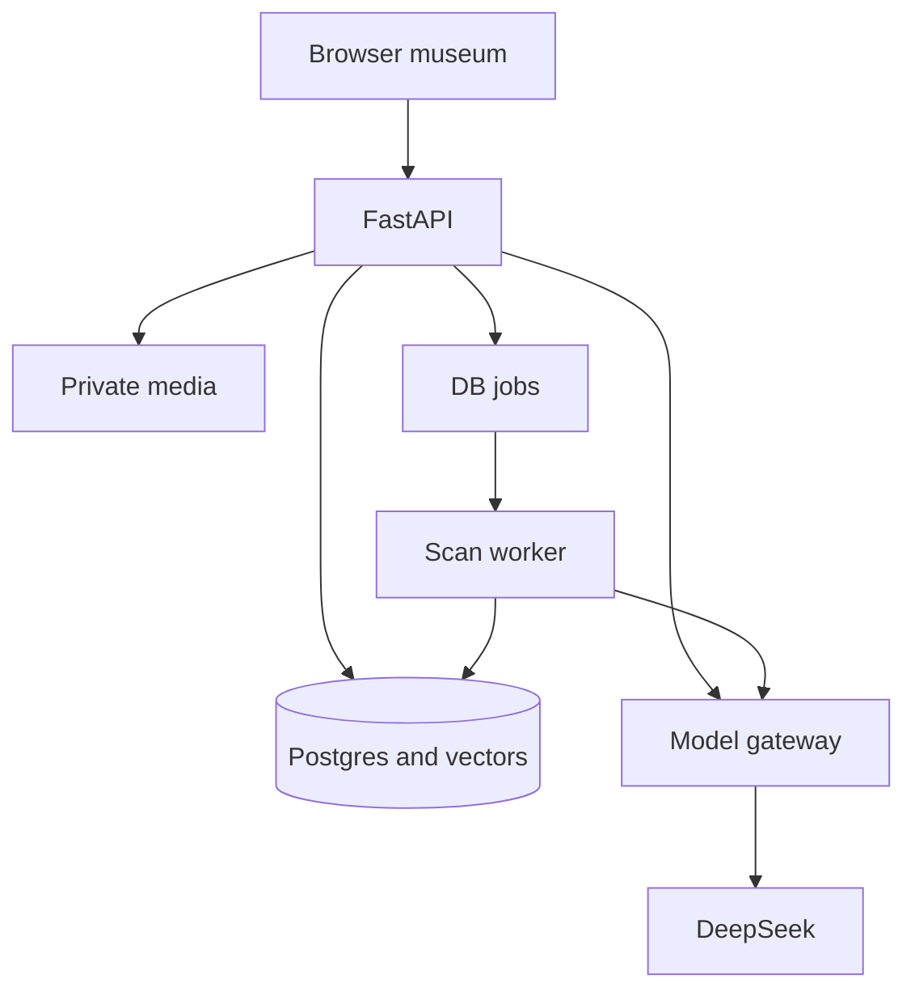

# Architecture and costs

| Layer | MVP choice | Boundary |
|---|---|---|
| UI | Next.js App Router, TypeScript, Tailwind, Motion | Pin compatible versions; retain existing repo conventions |
| API | FastAPI, Pydantic, SQLAlchemy, Alembic | One API service |
| Database | PostgreSQL + pgvector | Local instance first |
| Retrieval | BGE-M3 text; Chinese-CLIP image candidate encoder | Precompute corpus vectors; benchmark actual models and hardware |
| AI | DeepSeek provider gateway | Server secrets, usage limits, output validation; optional GLM disabled |
| Media | Local filesystem behind storage interface | Private uploads outside public assets; S3 later |
| Async work | Postgres jobs + one worker | Defer Redis for MVP; don't run long jobs in fragile request tasks |
| Speech | Explicit recorded-demo and optional live adapters | Recorded narration is not live voice interaction |
| Identity | Anonymous signed session | HttpOnly cookie, ownership, consent and reset/delete; full accounts later |
| Testing | Playwright and pytest | Contract, workflow, grounding and uncertainty checks |

No Kubernetes, vector SaaS, GPU rental, payment checkout or full 3D engine initially. Static scene artwork supplies the museum visual. Human cultural review remains real work.

## Suggested repository
| Path | Purpose |
|---|---|
| `apps/web` | Pages, UI components, translations and state |
| `apps/api` | API, services, model/storage adapters |
| `apps/api/migrations` | Versioned DB schema |
| `apps/api/worker` | Async scan job processing |
| `packages/contracts` | OpenAPI snapshot and generated frontend types/client |
| `data/seed`, `data/manifests` | Public, versioned corpus and rights metadata |
| `scripts` | Ingest, embeddings, cleanup and validation |
| `tests/e2e`, `tests/evaluation` | Functional and quality evidence |
| `design/reference`, `design/opendesign` | Target screens and design exports |
| `docs` | Setup, status, decisions, demo runbook |

Equivalent existing folders are acceptable; document mapping instead of disruptive restructuring.

## Request flow
Browser uses same-origin `/api/v1/*` through a proxy/BFF to FastAPI. Keys and all provider calls remain in FastAPI. Allow only configured development origins; no credentialed wildcard CORS. Preserve streaming at the proxy. HTTPS sessions use Secure/HttpOnly/SameSite cookies; protect state changes against CSRF with origin validation/token strategy.



## Environment names
Proposed development defaults, not provider guarantees. Never commit secrets.
```dotenv
APP_MODE=demo
DATABASE_URL=
SESSION_SECRET=
ALLOWED_ORIGINS=http://localhost:3000
DEEPSEEK_API_KEY=
DEEPSEEK_BASE_URL=https://api.deepseek.com
DEEPSEEK_MODEL=deepseek-flash
GLM_ENABLED=false
VOICE_MODE=recorded_demo
ASR_API_KEY=
TTS_API_KEY=
MEDIA_STORAGE=local
MEDIA_ROOT=
RAW_MEDIA_TTL_HOURS=24
MAX_UPLOAD_MB=10
MAX_IMAGE_PIXELS=16000000
MAX_AUDIO_SECONDS=60
MODEL_MAX_OUTPUT_TOKENS=800
MODEL_TIMEOUT_SECONDS=30
MODEL_MAX_CONCURRENCY=2
DAILY_AI_BUDGET_USD=1
```
The daily budget is a proposed ceiling, not permission to spend or an expected cost. Configure current price rates, reserve worst-case usage before a call, reconcile returned usage, and block new requests when the cap is exhausted. Unknown-priced model configurations must not bypass limits. Cancellation may not immediately stop provider billing.

## Free versus paid
Local packages and database can run on existing equipment without cloud subscriptions. Compute and storage still use resources. A local demo needs internet for live DeepSeek calls. Use HTTPS or localhost on the actual camera device: a phone visiting a laptop's ordinary HTTP LAN URL may not receive camera permission.

Optional bills are live speech, hosting, storage/traffic, a domain, GLM requests, licensed media and cultural review. Test provider access from mainland China and the actual pitch network; do not assume a free tier or foreign hosting works reliably. The report's RMB 17,400 is a broader pilot scenario, not an installation fee.

## Staged differences from the report
Redis, S3 and full accounts are deferred behind interfaces. Lexical search is a valid labelled baseline before BGE-M3. Metadata search using vision descriptors is a valid scan baseline before image vectors, but cannot be reported as completed dual-path retrieval. Recorded narration is a fallback, not completion of live STT/TTS. No metric becomes achieved without measured evidence.
